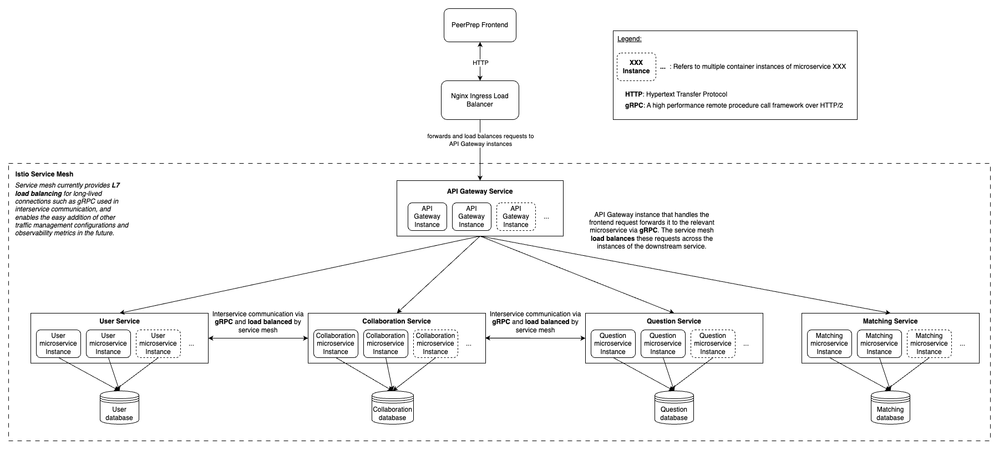

## Deployment
This directory holds the Kubernetes manifests for deployment to a Kubernetes cluster.

### Local K8s Cluster Setup
#### Prerequisites
1. Ensure [minikube](https://minikube.sigs.k8s.io/docs/start/), [helm](https://helm.sh/) and [kustomize](https://kustomize.io/) are installed on your local machine.
1. Ensure PostgreSQL, MongoDB and Redis are installed on your local machine. Start these services.

#### Setup minikube and build Docker containers
1. Start minikube (e.g. `minikube start`).
1. Run `eval $(minikube docker-env)` to set the environment .variables for the Docker daemon to run inside the Minikube cluster.
    - If `eval $(minikube docker-env)` is not compatible with your terminal (i.e. for Windows):
    - Then run `& minikube -p minikube docker-env --shell powershell | Invoke-Expression`
1. Ensure that you have set up the `.env` file from `.env.example` as stated in the [README for the backend directory](../README.md).
1. In the same terminal, build the docker images locally (e.g. `docker compose build`). Ensure that you are in the [`/backend`](../) directory of the repository or its subdirectories when doing so.

#### Install ingress-nginx
1. Install ingress-nginx via Helm on the minikube cluster.
    <!-- Installing directly from Helm to install ingress-nginx into a separate namespace 'nginx'. We cannot specify custom namespaces under 'dependencies' of our custom Helm chart -->
    - Add the ingress-nginx repo to Helm via `helm repo add ingress-nginx https://kubernetes.github.io/ingress-nginx`
    - `helm repo update`
    - Install ingress-nginx and create the `nginx` namespace via `helm install nginx-ingress ingress-nginx/ingress-nginx --namespace nginx --create-namespace`

#### Install Istio
1. (Helm) Install Istio via Helm on the minikube cluster.
    - Add the Istio repo to Helm via `helm repo add istio https://istio-release.storage.googleapis.com/charts`
    - `helm repo update`
    - `helm install istio-base istio/base -n istio-system --create-namespace --set defaultRevision=default`
    - `helm install istiod istio/istiod -n istio-system --wait`
    - `helm ls -n istio-system` (verify both charts have been successfully deployed)
    - `kubectl label namespace default istio-injection=enabled --overwrite` (enable [automatic sidecar injection](https://istio.io/latest/docs/setup/additional-setup/sidecar-injection/))
        - Run `kubectl get namespace -L istio-injection` to verify label has been set correctly
1. (Istioctl) Alternatively, install via istioctl (e.g. `brew install istioctl`)
    - `istioctl install --set profile=minimal`
    - `kubectl label namespace default istio-injection=enabled --overwrite` (enable [automatic sidecar injection](https://istio.io/latest/docs/setup/additional-setup/sidecar-injection/))
    - To uninstall, run `istioctl uninstall --purge`

#### Configuring TLS Certificate (for `prod` directory build only)
> The teaching team should ignore this step when running a `dev` build.
1. Install `cert-manager`.
    1. Referenced from [here](https://cert-manager.io/docs/installation/helm/)
    1. Navigate into the `deployment/backend` directory (e.g. `cd deployment/backend`).
    1. `helm repo add jetstack https://charts.jetstack.io`
    1. `helm repo update`
    1. `kubectl apply -f https://github.com/cert-manager/cert-manager/releases/download/v1.13.2/cert-manager.crds.yaml`
    1. `helm install cert-manager jetstack/cert-manager --namespace cert-manager --create-namespace --version v1.13.2`
1. Configure a static IP address for the cluster ingress (e.g. on GKE, refer [here](https://cloud.google.com/kubernetes-engine/docs/tutorials/http-balancer#optional_configuring_a_static_ip_address
)).
1. Register a domain name that points to the deployed k8s cluster ingress.
1. Run the k8s manifests in the section below on Deploy microservices.

#### Configuring Horizontal Pod Autoscaling
1. If you are on a minikube cluster (e.g. local development) and want to try out autoscaling, install the metrics server via `minikube addons enable metrics-server`.
1. Note that this deployment will only attempt to scale by CPU and not memory. This can be tweaked in the future beyond the project since we do not have specific business requirements specified in the given project document right now.

#### Deploy microservices
1. Navigate into the [deployment/backend](./backend/) directory (e.g. `cd deployment/backend`).
1. Copy [`custom-values.example.yaml`](./backend/custom-values.example.yaml) as `custom-values.yaml` and set the corresponding variables.
    1. For `dev` deployments, these values do not have to be changed if using the PostgreSQL, MongoDB and Redis services on your local machine (e.g. NOT the dockerized versions).
    1. For `prod` deployments, set the ingress `hostName` to the domain gotten from the previous section on TLS certificates.
1. Run `helm dependency update` to install the local `base-xxx` Helm charts.
1. Run `helm template peerprep-backend . --values ./values.yaml --values ./custom-values.yaml > ./base/backend.yaml` to generate the Helm templated K8s manifest.
    > For the following steps below, replace the `dev` in the **filepaths** with `prod` for deployment to production. The **teaching team** should use `dev` and build their own Docker images as outlined above.
1. Copy and set the backend [`.env.example`](../.env.example) file as `.env` to the [`deployment/backend/overlays/dev`](./backend/overlays/dev/) directory.
    - **IMPT NOTE (microservice hosts)**: Set all `{MICROSERVICE}_SERVICE_HOST` to `{microservice}.default.svc.cluster.local` (e.g. `QUESTION_SERVICE_HOST=question.default.svc.cluster.local`) and `{MICROSERVICE}_SERVICE_PORT` to the corresponding port specified in [`values.yaml`](./backend/values.yaml) inside the copied `.env` file.
    - **IMPT NOTE (database hosts)**: Set
        - All the `{MICROSERVICE}_SERVICE_SQL_DATABASE_HOST` to `peer-prep-external-postgres-service.default.svc`
        - All the `{MICROSERVICE}_SERVICE_MONGODB_URL` to `mongodb://peer-prep-external-mongodb-service.default.svc:27017/{database_name}`
        - `REDIS_HOST` to `peer-prep-external-redis-service.default.svc`.
        > For `prod` builds, this step above can be ignored if you are able to specify the private VPC IP to the above services in the `.env` file itself.
    - **IMPT NOTE (Google OAuth)**: Set `OAUTH_GOOGLE_REDIRECT_URL=http://localhost/v1/auth/google/redirect` (modify URL for `prod` accordingly).
    > For the remaining unset environment variables, refer to the instructions [here](../README.md#environment-variables-setup) to configure them.
1. Run `kustomize build overlays/dev` to check that kustomize has been configured correctly, and can successfully override the values from the K8s manifest generated above by Helm.
    - The updated K8s manifest will be printed to the terminal if successful.
1. Run `kustomize build overlays/dev | kubectl apply -f -` to apply the kustomized K8s manifest file in the minikube cluster and deploy our microservices
1. Verify that the deployment has been orchestrated properly after a few minutes (e.g. `kubectl get all`), and that there are no errors in the pods.

#### Connecting to ingress from localhost
1. Run `minikube tunnel` to connect to the nginx LoadBalancer service
1. Access the nginx server via `http://localhost`
> To connect the frontend to ingress, modify the [`.env.development`](../../frontend/.env.development) in the `/frontend` directory and remove the port numbers (e.g. `VITE_BACKEND_API_HOST=http://localhost` and `VITE_BACKEND_WEBSOCKET_HOST=ws://localhost/ws`)
<!-- 1. To access the API gateway from localhost, run `kubectl port-forward deployment/http-gateway 4000:4000`. This is a temporary workaround until the ingress is properly configured. -->

### Testing out Horizontal Pod Autoscaling
Let's test that the Horizontal Pod Autoscaling (HPA) works as configured (we will generate load to the `http-gateway` deployment in the following example to demonstrate HPA):
1. Ensure that the `dev` (NOT `prod`) deployment has been setup and runs correctly as per the previous steps (e.g. `kubectl get all`).
1. Run a pod to generate load to the `http-gateway` deployment via `kubectl run -i --tty load-generator --rm --image=busybox --restart=Never -- /bin/sh -c "while sleep 0.01; do wget -q -O- http://http-gateway:4000/v1/loadtesting; done"`
    - NOTE that this endpoint only exists in a non-production environment
1. Wait 2-3 minutes for the CPU usage to spike. Monitor the HPA via `kubectl get hpa hpa-http-gateway-microservice --watch` in a separate terminal (check the TARGETS column for the usage and target threshold)
    - Once the usage spikes beyond the threshold of 50%, check the number of pods in the `http-gateway` deployment (e.g. `kubectl get all`)
    - The number of pods should increase to 2 or 3 as configured in `values.yaml`
1. Ctrl-C to terminate the load-generator pod from the previous step and run `kubectl delete pod/load-generator` to delete it.
1. After a few minutes, verify that the number of pods has been scaled back down to 1 as configured under `minReplicas` of the custom base-microservice Helm chart.

### Pushing Docker images (for production release)
1. Run `docker compose build` to build the latest images. (should be building on platform `linux/amd64` for production deployments)
1. Login to DockerHub via `docker login`.
1. Push the images to DockerHub via `docker compose push`.
> Alternatively, a GitHub Action has been configured to build and push to the remote DockerHub repository on push to `master`.

### Deployment Architecture Diagram

